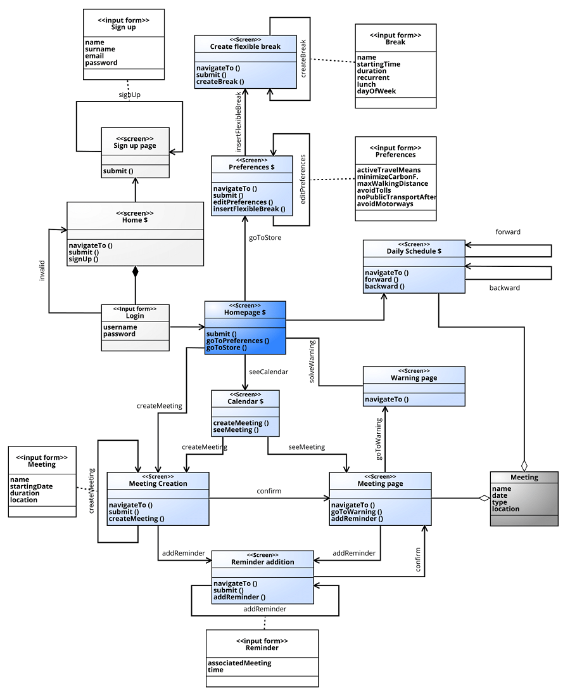
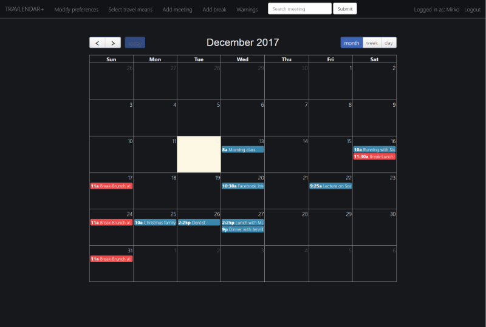
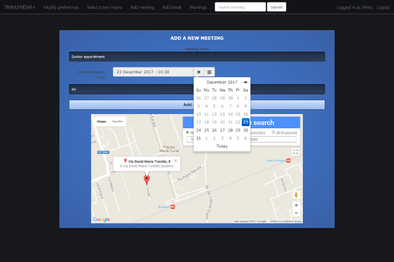
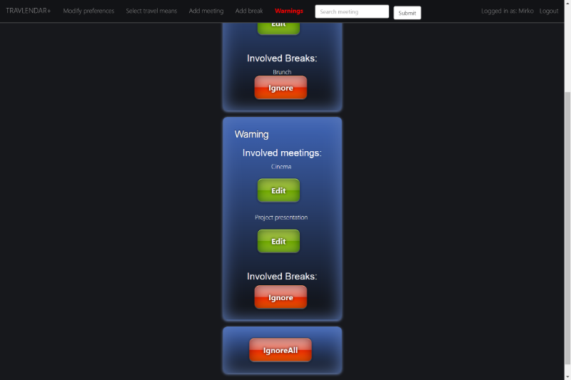
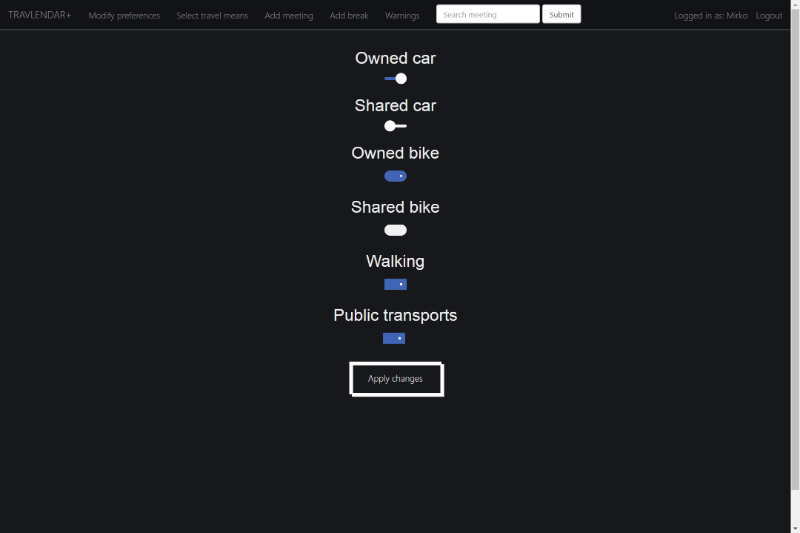
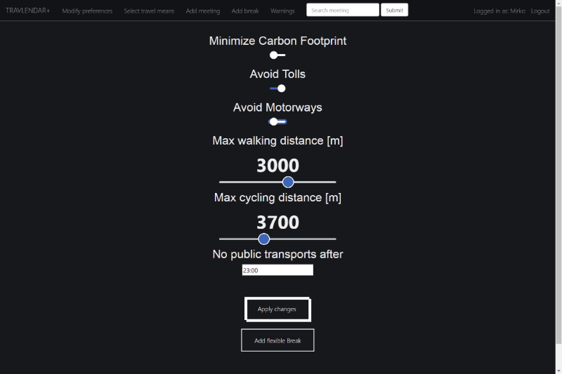

# Travlendar+

_Mirko Mantovani_ and _Matteo Marziali_

    Politecnico di Milano
    A.A. 2017-2018
    Software Engineering II project
    
    

---

Introduction
============

The main purpose of Travlendar+ is to create a software that allows
users to easily manage their daily meetings and commitments, by
providing some useful features such as finding the best means of
transport to reach the appointment place and easily know the quickest
route available to be punctual.\
Specifically, we want to realize a product which is able to:

-   Provide a calendar and the possibility to memorize events and
    appointments on it.

-   Automatically compute and account for travel time between
    appointments to make sure that the user is not late for them.

-   Automatically generate warnings to notify the user that at least two
    meetings are overlapping.

-   Provide routes and travels according to user preferences about the
    preferred/prohibited travel means and daily breaks set.

-   Provide the possibility to add reminders for a meeting in order to
    prevent the users forgetting their appointments.

-   Allow the users to modify appointment schedules.

-   Automatically notify people involved in a specific meeting if the
    user is late and has selected this feature previously.
-------

Implemented functionalities
===========================

The set of functionalities we actually implemented with respect to the
ones we initially defined are:

\[F1\] Signup and Login
-----------------------

Travlendar+ users must sign up the first time they intend to use the
App, further usages of the app will require a login to access all its
functionalities. Logout which will invalidate the current session and
take the user to the login page is also present.

\[F2\] Meeting creation
-----------------------

This is the most important function of the app, it allows to generate an
event related to an appointment. It requires the user to define all the
details such as date, time, location.

\[F3\] Preferences set up
-------------------------

An important feature of Travlendar+ consists in allowing the user to
filter out specific routes depending on some constraints about the
travel, or to set break-dedicated time slots. In particular the
preferences we implemented are:

-   Minimize carbon footprint option, the result of flagging this option
    is that if possible (there exist at least a route and the travel
    means constraints are satisfied) only walking, cycling and public
    transportations routes will be taken into consideration.

-   Avoid tolls option which will only affect driving mode, only routes
    without tolls will be considered.

-   Avoid motorways option which will only affect driving mode, only
    routes without highways (motorways) will be considered.

-   Setting up a maximum walking distance and taking into consideration
    only the routes which satisfy this constraint

-   Setting up a maximum cycling distance and taking into consideration
    only the routes which satisfy this constraint

-   Setting up a time from which the routes involving public
    transportations will be discarded, in particular, the User can
    select the time between the range 18:00 and 5:30, from that time
    till the morning any route involving public transportations will be
    avoided.

-   Specifying the travel means the user intends to use for his travels,
    possible travel means are:

    -   Owned car

    -   Shared car

    -   Owned bike

    -   Shared bike

    -   Walking

    -   Public transports

\[F4\] Warnings management
--------------------------

In case a warning is generated by the system due to a possible overlap
among two or more meetings, the user must solve the warning. In other
words, the user has to decide whether he wants to ignore the warning
notification or he intends to modify some meetings to be sure that he
can reach and participate to all his appointments. In particular the
warning are created if:

-   There exists a break in the database and the user adds a meeting
    that makes the break impossible to actually be scheduled in the
    allowed time, this case happens if the overlapping meetings don’t
    leave a free interval within the break range which is greater or
    equal to the break minimum duration.

-   The minimum amount of time in order to get to the previous meeting
    location to the inserted one exceeds the interval there is between
    the ending time of the previous meeting and the starting time of the
    newly added meeting.

-   The added meeting partially or totally overlaps in any possible
    combination with one or more meetings already present in the
    database. In this case a warning containing all the involved meeting
    is created

Notice that there should not be a meeting appearing in more than one
warning, if that is the case a cleaner method is periodically invoked in
order to mantain this consistency, there can also exist warning
containing one or more breaks and one or more meetings, however, no
warning consisting in only breaks without meetings.

\[F5\] Route generation
-----------------------

When requested, the app is able to find a route, if possible, from the
specific location the user is at in the moment to the location of the
considered meeting, the suggested travel will fit and satisfy the
selected preferences.

\[F8\] Update/Delete meeting
----------------------------

This function is both basic and relevant, it allows the user to
customize his meetings after their creation. In particular, everything
except the name (since it’s part of the identification of the meeting)
can be modified.

\[F9\] Add/Delete break
-----------------------

This feature at first was specified as part of the preferences, however,
since we considered that this is one of the main features, we named it
alone as an independent functionality. The Flexible break is a slot of
time in the day to be reserved for specific purposes (such as a lunch
for example), the break has a starting time and an ending time, which
are the extremes times in which the break must be contained, the break
itself however will only last the time specified by the Duration
attribute. The day to specify for the break is in the form of the day of
week (monday, tuesday, ecc.), which means the first occurrence of that
day of week from the creation time. The Break could also be recurrent,
which means every week in that day of the week a break will be
scheduled. The break is flexible in the sense that the actual break only
lasts for a time specified by the duration and Travlendar will make sure
that the user has at least that free time available inbetween his
meetings, if not a Warning will be generated.

\[F10\] Search meeting
----------------------

An added functionality with respect to the ones we initially defined is
the seach meeting, it allows the user to search for a meeting by typing
part of the name, the result will be the page of the best match meeting
page, if any.

User Experience
==============================

Mockups of the User Interface
-----------------------------

Concerning the user interface requirements, we established to directly
provide information about the application screens and layout through
several mockups.
We designed the sketch of the main pages of Travlendar+ following our
aim to make a light and user friendly product but, at the same time, we
have pursued an attractive and impressive style
Apparently, the coding phase could affect our desing. Hence, these
sketches are not definitive, their aim is to give an idea of the
application design.
For this reason, if we notice that some changes are necessary due to
either app. improvement or obstacles in realization, we would be ready
to modify them.

### Homepage

To pursue our aim of realizing a user-friendly and light app, we decided
to provide the main functions directly in the homepage. Indeed, from
this page, a guest can reach the sign up form, a user can log himself
in,can insert a meeting by tapping onto a day in the calendar,can manage
his preferences and even access the warnings

### Meeting Creation

This page is a very simple form, which allows the user to finalize the
creation of a meeting by filling it in all its fields. The house-logo in
the right corner,on the top band and near the application name,
represents the return-to-homepage icon.

### Warning Page

The warnings page has the role to summarize and notify all the conflicts
among meetings which involve the user’s appointments. Every warning is
represented by a dialog which points out the meetings that generate the
conflict and which has two buttons, one to ignore the warning and other
one to solve it by modifying the conflictual meetings. To prevent too
much user’s clicks, an “ignore all” button is provided, which is
equivalent to tap “ignore” for each warning in the list.

### Travel means preferences

This is a very simple page with a minimalistic design, not to uselessly
load the application. However, this basical view provides all the
functions which the user needs to select his preferences related to the
transports for his travels. Please notice that the preferences section
can be changed by tapping on an specific topic just below the
“Preferences” bar.

### Route preferences

The route preferences page is very similar to the Travel mean
preferences page. The style is the same and the opportunity to flag or
unflag elements too, however there are differences. Some of the
preferences in this section are mutal exclusive, so the user is
prevented to select more than one of them (for instance a user can
select either the shortest route or the fastest). Moreover, some
selection element has customizable details, they are represented with a
pencil logo on the right, and can be managed by the user to best fit his
preferences (for example the user can select after which hour he does
not want to use public transportations).

Adopted development frameworks
==============================

Adopted programming languages
-----------------------------

To implement Travlendar+ we mainly used Java. The front-end was created
using HTML, css and javascript while the back-end is plain Java and for
it we adopted some of the functionalities that JEE provides.

Adopted middlewares and libraries
---------------------------------

We could say that the main middleware we used is Glassfish Web server,
it provided us with the functionality of using the Java Persistence API
framework in an easy way, allowing us to define and create the entities
in the database and mapping them to Java classes. Other adopted
frameworks are bootstrap and jquery, in order to simplify the creation
of an enhanced UI/UX. The only library we used is json.simple, a library
to simply parse the JSON files arrived as a response by the Google Maps
APIs in order to retrieve specific and useful information.

Used APIs
---------

The main APIs we interfaced with are Google Maps APIs, such as:

-   Google Maps Distance Matrix API to: Estimate travel time and
    distance from origin to destination.

-   Google Maps Directions API to: Calculate directions between origin
    to destination specifying the means of transport.

-   Google Maps Place Autocomplete to: Input real addresses for meetings
    avoiding mispelling of addresses

Source Code structure
=====================

The following two subsections will be needed for any external person in
order to understand the code structure and possibly modify or extend the
Application.

Back end code structure
-----------------------

The back end code of the application is logically subdivided into four
Source Packages:

-   **Entities**: This package contains all the Java entity classes
    which, due to the JPA mapping to the database entity tables, allow
    us to directly manipulating persistent data by simply setting fields
    of the relative instances. Each of these classes has a few named
    queries to easily retrieve data sets from the database, fields with
    specifications defining the SQL type and constraints on the
    attributes of the database tables, and getters/setters.

-   **Servlets**: This package contains all the servlets which are
    needed by the server in order to handle http get/post requests and
    responses, most of the used and significant endpoints are managed in
    these servlets. In our case servlets can either process data in the
    requests and interact with Java beans in order to make some changes
    in the persistent memory, or they are used as access points to JSPs
    and their purpose in this case is mainly that of customizing the JSP
    based on the User Session.

-   **Session Beans**: This package contains all the EJB needed both for
    interacting with the database and to run concurrently some weighty
    and onerous algorithms such as conflict checking between meetings.
    The common abstract class AbstractFacade exposes methods to interact
    with the database by mapping the methods to the corresponding method
    call on the JPA EntityManager interface. One facade per entity
    extend the abstract one and contain a few additional methods to
    handle queries if needed.

-   **Utils**: This package mainly contains plain Java classes with
    static services methods to be used by servlets and Beans.

Front end code structure
------------------------

The front end of the application is primarily composed by JSPs, in which
we decided not to put any scriplets in order not to have the possibility
for any runtime exception to occur. We thought it would be better to
have semantical incorrectness than exceptions, that is why we decided to
use JSTL/EL to give dynamicity to the plain html code of the JSPs
The JSPs html code is enriched with css and javascipt to make it more
appealing and responsive. We also used and included in the source code
jquery framework and bootstrap.

Testing
=======

In order to evaluate the consistency and the reliability of our
application we have conducted some unit tests
The tests regard the business logic tier, the core of the application in
terms of complexity and relevance of computation
Considering that the business logic classes interacts directly with data
in the database, we had to adopt a specific framework, named “Mockito”
to Mock the method calls which retrieve data from the database and to
specify an action to be performed in case of calls during testing
execution
It is relevant to say that we adopted this mocking framework assuming
that the operations related to reading and writing data in the database
are executed correctly, indeed they are not tested with a proper testing
component. However, we are quite confident that this assumption is
consistent because we checked it informally 
As far as the unit test are concerned, we have checked them using jUnit
libraries
Finally, we have tested also that the calls to the Google Maps APIs,in
particular the Distance Matrix API. We checked that it was executed
correctly and that the retrieved information was consistent
Further details about the test cases and the related outcomes have been
included in the document

JUnit and Mockito
-----------------

### Meeting vs. Meeting Conflict

This test case has the purpose to evaluate the method to check whether
two meeting are in conflict. Considering that this kind of evaluation
involves two meetings at a time, we have built two meetings, we have
assigned them overlapping schedules and we have tested the execution of
the method ’CheckMeetingOverlaps(Meeting m)’ of the class
ConflictCheckerBean.java . The result of the test was consistent with
the expected outcome.

### Meeting vs. Break Conflict

This test case was made to check whether the conflict among meetings and
breaks was computed correctly. Due to the fact that the comparison
involves one meeting and one break at a time, we have built a break and
a meeting that should have been overlapping and we tested the execution
of the method ’BreakConflictChecker(Meeting m)’ of the class
ConflictCheckerBean.java . As we expectd, the outcome certified that the
conflict was computed.

### Flexible break rescheduling

In order to verify the flexible break rescheduling, one of the main
functions of Travlendar+, we made an apposite test case. This analysis
simply consists in calling the method checkReschedule(String uid) of the
class ConflictCheckerBean.java and checking that the outcome, in case
the flexible rescheduling is infeasible, reports that effectively the
meeting and the break are in conflict.

### Warning existence 

this test case regards this specific situation: a new Meeting is
inserted in the db and according to its conflicts, it should be added in
an already existent warning in the database. Hence, this analysis tests
whether the already existent warning to be updated is retrieved
correctly. To perform the test we have simulated the insertion of a
warning in the database and we have created a meeting that had to be
added to the existent warning. Then, we have called the method
’checkWarningExistence()’ of the class ConflictCheckerBean.java and we
verified that the outcome was consistent. Finally, for completeness, we
replayed the test to check also a situation in which a new warning has
to be created.

### Retrieve duration

The current test case has the purpose to verify the interaction between
our application and the Google Maps APIs. In particular we checked that
the requested information is retrieved correctly by testing if the
duration of a specific travel is correct, doing this we also tested the
connection with Google servers and the correctness of our queries. In
other words we called the method retrieveDuration(String origin,String
destination, String uid, Date date) of the class
RouteCalculatorBean().java and we passed them an origin and a
destination parameter for which we already know the travel duration and
we expected the same outcome.

JMeter
------

We also made a really trivial test to evaluate the non-functional
requirements and in particular the performances given an high number of
clients requesting a resource. The test was done using JMeter and the
simple test consisted having a thousand users trying to access the
application by performing a login and visiting the homepage, the
requested are done almost all at the same time (ramp-up period equal to
zero which means no delay between requests)
As you can see from the below graph the latest visited the homepage
after less than 3 seconds, which suggests than the performances of the
server are already a bit stressed and if the same amount of users
requested a more sophisticated resource that would require
computationally onerous algorithms by the server, the amount of time
requires would probably not be reasonable for a user experience point of
view. Notice however that, in such an application, users would mostly
navigate in a burstly way, which implies that in order to have a
thousand requests at the same exact time, the number of users would have
to be much larger than a thousand.

Installation Instructions
=========================

Quick Installation for Windows
------------------------------

The quick installation consists in downloading Glassfish 4.1.1 with the
script to install Travlendar and the war file already in it.

-   Download the JDK if you don’t have it already from\
    [http://www.oracle.com/technetwork/java/javase/downloads/jdk8-downloads-2133151.html](url),
    usually it is stored in C:\\Program Files\\Java, put it there or
    wherever you prefer, keep in mind or save the path where you put it.

-   Download the zip by clicking on this link:\
    [https://www.dropbox.com/s/itycorsvfimpy5w/glassfish-4.1.1.zip?dl=1](url),
    unzip the folder and put the contained folder (glassfish-4.1.1) in
    C:\\Program Files. In case you have a different JDK from the
    jdk1.8.0\_121 version, or you have it in a different folder than the
    default one, navigate to\
    *C:\\Program
    Files\\glassfish-4.1.1\\glassfish\\domains\\domain1\\config*, open
    domain.xml file search for java-home attribute (there is only one,
    the one of java-config node) and substitute C:\\Program
    Files\\Java\\jdk1.8.0\_121 with the path of your JDK.

-   Then open the glassfish-4.1.1 folder and double click on
    installtravlendar file.

-   Click yes to the popup that asks if you want to run it as
    administrator.

-   Write down in the Command Prompt the JDK path when asked for it, for
    example write: C:\\Program Files\\Java\\jdk1.8.0\_121

-   Press enter.

-   Wait for the command prompt to close itself then Travlendar should
    be installed correctly.

-   Launch travlendar by double clicking on Travlendar+ file in
    glassfish-4.1.1 folder.

-   If everything went fine the default browser should have been
    launched and you should see the login page of the app, signup and
    enjoy the app.

System Requirements
-------------------

### JDK

In case you don’t have any version of Java Development Kit you should
download its latest version from:\
[http://www.oracle.com/technetwork/java/javase/downloads/jdk8-downloads-2133151.html](url)

### Glassfish Web Server

Being Travlendar+ a web application, it is essential to have a web
server installed, here we provide information about the installation and
deployment on Glassfish 4.1.1. You can download it from\
[https://javaee.github.io/glassfish/download](url)\
or alternatively, you can follow the quick installation instructions for
Windows, which includes a Glassfish installation.

### DBMS

For simplicity, we decided to use the basic DBMS provided by glassfish,
Apache Derby RDBMS, thus you do not need anything else if you have
installed Glassfish Server.

### Browser

For the development and testing we always used Google Chrome as browser,
we recommend installing the latest version of Chrome and we do not
guarantee the absence of bugs and poor performances on other Browsers,
even if they would probably work just as fine.

Manual installation - Environment Setup
---------------------------------------

### Starting up Glassfish Server

-   On Windows, open command prompt as administrator (right click on
    cmd.exe and click Run as administrator), on Linux or MacOS open
    Terminal.

-   browse to Glassfish installation path and open bin folder, usual
    installation path on Windows: *C:\\Program
    Files\\glassfish-4.1.1\\bin*, execute command *cd C:\\Program
    Files\\glassfish-4.1.1\\bin*

-   execute command *asadmin start-domain*

After the server has started you will be able to access the Admin
Console at\
[https://localhost:4848](url) and the web server at\
[https://localhost:8080](url)\
(If you need to stop Glassfish server just execute command *asadmin
stop-domain*

### Setting up JDK path

Sometimes an error is displayed if Glassfish does not find the JDK
automatically, you can execute the command\
*asadmin set “server.java-config.java-home=C:\\Program
Files\\Java\\jdk1.8.0\_121”*\
Just substitute *C:\\Program Files\\Java\\jdk1.8.0\_121* with your path
to the JDK you previously downloaded.

### Database configuration

In order to make it simpler to create the database you can download the
already configured Derby database from\
[https://www.dropbox.com/s/8c8rjc40b86wj77/travlendar.zip?dl=1](url)\
Unzip it and put it in the folder: *\glassfish\\databases*\
in the glassfish installation path (on Windows usually\
*cd C:\\Program Files\\glassfish-4.1.1*

### Starting Apache Derby DBMS

Execute command\
*asadmin start-database*\
in order to start the database.

Be sure the port is the default one (1527)
If at any moment you want to stop the database just execute command\
*asadmin stop-database*

Application Deployment
----------------------

After having configured and set up the environment, download the `.war`
file `Travlendar.war` at\
[https://github.com/MatteoMarziali/MarzialiMantovani/releases/download/v1.0/Travlendar.zip](url),
unzip it where you prefer
You can now follow one of these ways in order to deploy the Application
on Glassfish.

### Manual deployment from Admin Console

After the server has started you will be able to access the Admin
Console at\
[https://localhost:4848](url)\
Click on `Applications` tab on the left. Then click `Deploy...` button.

Click on `Choose file` and select the `Travlendar.war` release file
previously downloaded, then click ok.

If everuthing went fine you should see something similar to this.

Just click on `Launch` to start the application
You can access the application opening the URL:\
[https://localhost:8080/Travlendar](url)

### Manual deployment from Command Line

Supposing you already started the server and the database, and you are
in the bin folder in the Glassfish installation path, just execute\
*asadmin deploy C: \\Users\\Mirko \\Desktop\\Travlendar.war*\
substituting *C: \\Users\\Mirko \\Desktop\\* with your path to
`Travlendar.war` release file.

You can now access the application by executing\
*start http://localhost:8080/Travlendar/* on Windows, *open
http://localhost:8080/Travlendar/* on MacOS X, or *xdg-open
http://localhost:8080/Travlendar/* on Linux, or simply open the browser
and type *localhost:8080/Travlendar* in the URL bar and press Enter.

### Autodeployment

Just put the `Travlendar.war` file in
*&lt;GlassFish-Installation-Path&gt;/domains/domain1/autodeploy* and
restart the server.

Running the app
---------------

Once the deployment is finished you can access the Application at
*localhost:8080/Travlendar* on a browser in your local machine, at
*192.168.1.3:8080/Travlendar* on a device connected to the same LAN
(just replace *192.168.1.3* with the private IP address of the machine
the server is running on
You can even access the application from a remote device, you just need
to open the port 8080 of the router of your LAN by creating a virtual
server and NATting the external access onto the private IP address of
the machine your server is running on (private IP should be configured
as static). Then you can access from wherever you want just by going to
*xx.xx.xx.xx:8080/Travlendar*, replace xx.xx.xx.xx with the public IP
address of your router.

Possible issues and solutions
-----------------------------

If you encounter any problem in the deployment regarding a database
connectivity problem you could download Netbeans IDE (which includes
Glassfish and Derby installation) and replace the Environment setup
steps by creating a database with databasename = travlendar, name =
mirko, password = mirko. Start glassfish server from there and then pass
to the deployment phase as explained in these instructions
If also this does not let you deploy the app as last chance you could
clone the travlendar repository, import it as a project in netbeans
build and clean the project, and run it.
